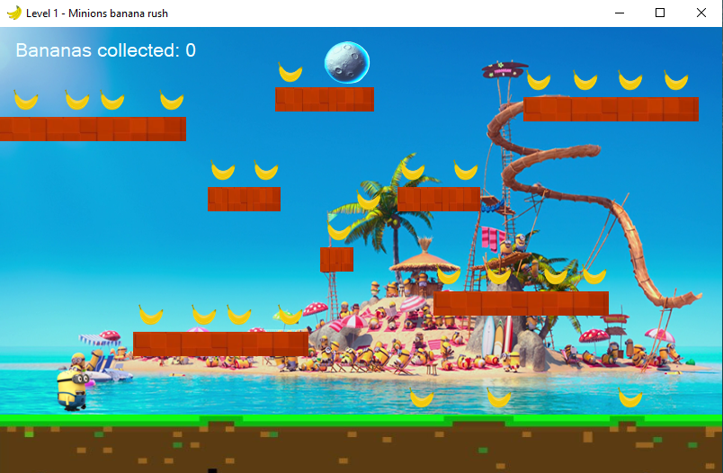
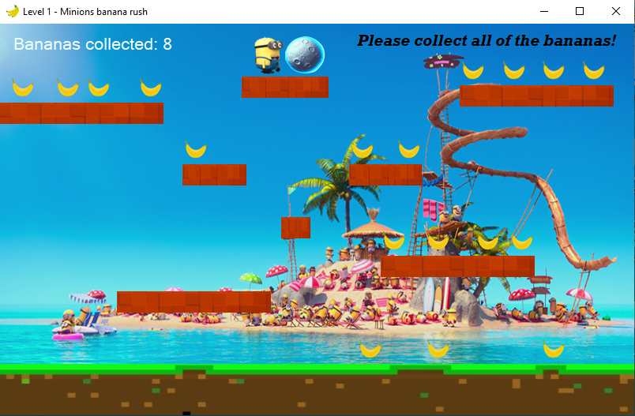
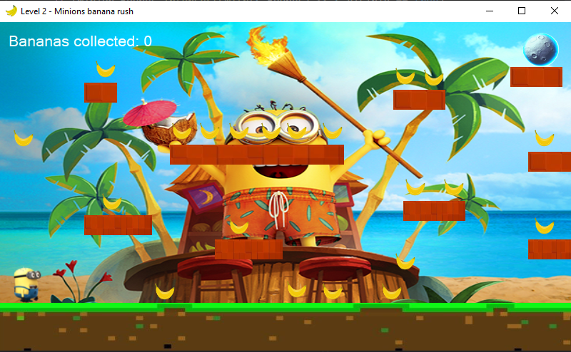
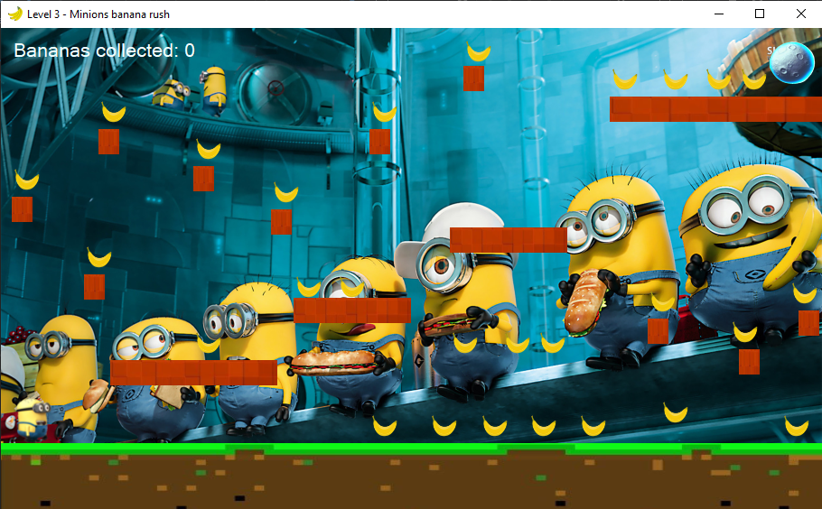
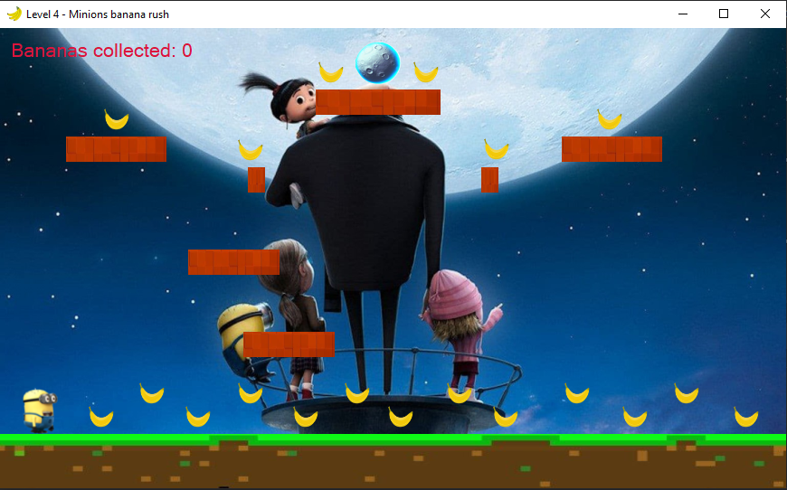

# Minions Banana Rush
Windows forms project by: Aleksandar Dimkoski
<br>

## Краток опис на апликацијата
Minions Banana Rush претставува едноставна забавна прогресивна игра која се состои од четири нивоа. Секое ниво се победува така што играчот треба да ги 
собере сите банани и да отиде до месечината. Играта не е имплементација на друга игра, меѓутоа е слична на многу други 
платформски игри како Super Mario, Fireboy and Watergirl и слични.

## Упатство за користење

### 1. Опис на формите во апликацијата
При вклучување на апликацијата се прикажува формата Main Menu преку која што се стартува играта. 

<p align="center">
     <br>
    <i>Слика 1: Главно мени на апликацијата</i>
</p>

При клик на копчето Start Game се вклучува првото ниво од играта прикажано на Слика 2, додека пак при клик на копчето Instructions & Info се отвара страната од играта на
github каде можат да се најдат сите информации за играта.

<p align="center">
     <br>
    <i>Слика 2: Ниво 1 на играта</i>
</p>

Откако ќе се соберат сите банани и ќе се дојде до месечината нивото се смета за поминато, и ќе се прикаже messagebox како на Слика 3 каде што доколку играчот кликне ок, ќе
се ќе се отвори ниво 2, а доколку кликне Cancel ќе се затвори формата.

<p align="center">
     <br>
    <i>Слика 3: Порака при поминато ниво</i>
</p>

Доколку играчот отиде до месечината но не ги собрал сите банани ќе му се прикаже порака како на Слика 4.

<p align="center">
     <br>
    <i>Слика 4: Порака доколку не се собрани сите банани</i>
</p>

Во продолжение се прикажани останатите нивоа на играта:

<p align="center">
     <br>
    <i>Слика 5: Ниво 2</i>
</p>

<p align="center">
     <br>
    <i>Слика 6: Ниво 3</i>
</p>

<p align="center">
     <br>
    <i>Слика 7: Ниво 4</i>
</p>

Карактеристично за нивоата 2,3 и 4 е тоа што дел од платформите се движат по x или y оска.

### 2. Контроли за играње

← - Го движи карактерот на лево

→ - Го движи карактерот на десно

Space key - Скок

### 3. Опис на имплементацијата

Играта е имплементирана со помош на тајмер, два keyUp и keyDown настани и pictureBox компоненти. Главната форма служи како контролер кој ги отвара сите 
други форми и во продолжение може да се види btnStartGame_Click настанот кој што при клик на Start Game се активира и потоа за секое ниво проверува дали е поминато:
```c#
private void btnStartGame_Click(object sender, EventArgs e)
        {
            Level1 l = new Level1();
            var d = l.ShowDialog();
            if (d == DialogResult.OK)
            {
                Level2 l2 = new Level2();
                var rez = l2.ShowDialog();
                if (rez == DialogResult.OK)
                {
                    Level3 l3 = new Level3();
                    var rezl3= l3.ShowDialog();
                    if (rezl3 == DialogResult.OK)
                    {
                        Level4 l4 = new Level4();
                        var rezl4 = l4.ShowDialog();
                        if (rezl4 == DialogResult.Yes)
                        {
                            Application.Restart();
                        }
                        else if (rezl4 == DialogResult.No)
                        {
                            this.Close();
                        }
                    }
                }
                if (rez == DialogResult.Cancel)
                {
                    l2.Close();
                }
            }
            else if (d == DialogResult.Cancel)
            {
                l.Close();
            }
        }
```
Со помош на настаните keyUp и keyDown се контролира дали играчот кликнал space,left или right. Во формата се чуваат локални bool променливи на кои вредностите им се
менуваат со помош на овие настани:
```c#
private void Level1_KeyDown(object sender, KeyEventArgs e)
        {
            if (e.KeyCode == Keys.Left)
            {
                left = true;
            }
            if (e.KeyCode == Keys.Right)
            {
                right = true;
            }
            if (e.KeyCode == Keys.Space)
            {
                jumping = true;
            }
        }
```
```c#
private void Level1_KeyUp(object sender, KeyEventArgs e)
        {
            if (e.KeyCode == Keys.Left)
            {
                left = false;
            }
            if (e.KeyCode == Keys.Right)
            {
                right = false;
            }
            if (jumping == true)
            {
                jumping = false;
            }
        }
```
Главниот дел кој контролира се што се случува во играта е тајмерот, кој се вклучува штом ќе се вклучи формата. Во timer_Tick настанот
се проверуваат bool променливите и соодветно доколку се true се менува позицијата на карактерот по x и y оска. 

Дополнително во еден foreach циклус се проверуваат сите
контроли во играта и доколку карактерот дојде во одреден судир со било кој од останатите компоненти се извршува одреден код. Пример доколку карактерот дојде во
судир со pictureBox компонента banana се менува visible својството на компонентата и се зголемува score променливата, дополнително во if условот се проверува дали
visible својството на компонентата е false за да не дојде да се зголемува score променливата повеќе пати доколку карактерот помине повеќе пати до неа.
```c#
if ((string)c.Tag == "banana")
{
       if (minion.Bounds.IntersectsWith(c.Bounds) && c.Visible == true)
       {
            c.Visible = false;
            score++;
            lbScore.Text = "Bananas collected: " + score;
       }
}
```
Во продолжение може да се види целиот timer_Tick настан:
```c#
private void timer_Tick(object sender, EventArgs e)
        {
            minion.Top += minionJumpSpeed;
            if (left == true)
            {
                if (minion.Left >= 0)
                {
                    minion.Left -= minionSpeed;
                }
            }
            if (right == true)
            {
                if (minion.Left <= this.Width-minion.Width)
                {
                    minion.Left += minionSpeed;
                }
            }
            if(jumping==true && gravity < 0)
            {
                jumping = false;
            }
            if (jumping == true)
            {
                minionJumpSpeed = -10;
                gravity -= 1;
            }
            else
            {
                minionJumpSpeed = 10;
            }

            foreach (Control c in this.Controls)
            {
                if (c is PictureBox)
                {
                    if (c.Name.Equals("ground"))
                    {
                        if (minion.Bounds.IntersectsWith(c.Bounds))
                        {
                            gravity = 5;
                            minion.Top = c.Top - minion.Height;
                        }
                        c.BringToFront();
                    }
                    if ((string)c.Tag == "platform")
                    {
                        if (minion.Bounds.IntersectsWith(c.Bounds))
                        {
                            gravity = 5;
                            minion.Top = c.Top - minion.Height;
                        }
                        c.BringToFront();
                    }
                    if ((string)c.Tag == "banana")
                    {
                        if (minion.Bounds.IntersectsWith(c.Bounds) && c.Visible == true)
                        {
                            c.Visible = false;
                            score++;
                            lbScore.Text = "Bananas collected: " + score;
                        }
                    }
                    if (c.Name.Equals("moon"))
                    {
                        if (minion.Bounds.IntersectsWith(c.Bounds) && score==26)
                        {
                            timer.Stop();
                            var rez=MessageBox.Show("Congrats, you won this level! Would you like to " +
                                "proceed to the next one?", "Level successfully done", MessageBoxButtons.OKCancel);
                            if(rez == DialogResult.OK)
                            {
                                DialogResult = DialogResult.OK;
                            }
                            if (rez == DialogResult.Cancel)
                            {
                                DialogResult = DialogResult.Cancel;
                            }
                        }
                        if (minion.Bounds.IntersectsWith(c.Bounds) && score != 26)
                        {
                            lbError.Text = "Please collect all of the bananas!";
                            lbError.Visible = true;
                        }
                        if (!minion.Bounds.IntersectsWith(c.Bounds))
                        {
                            lbError.Visible = false;
                        }
                    }
                }
            }
        }
```
Во нивоата 2,3,4 платформите кои се движат по x или y оска се имплементирани така што во timer_Tick настанот, на секој tick се менува позицијата на платформата според
променливата horizontalSpeed која е поставена на 4, и од каде до каде ќе се движи се контролира со if условот кој може да се види подолу:
```c#
            h1.Left -= horizontalSpeed;
            if (h1.Left < 0 || h1.Left+h1.Width > this.Width)
            {
                horizontalSpeed = -horizontalSpeed;
            }
```
